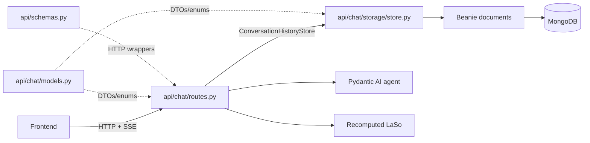
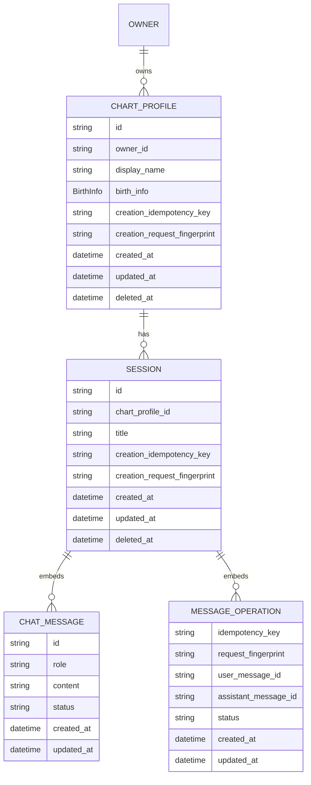
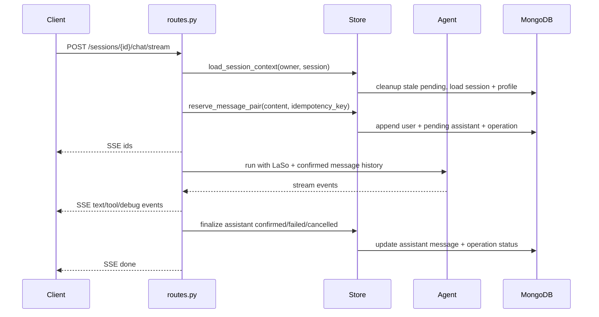
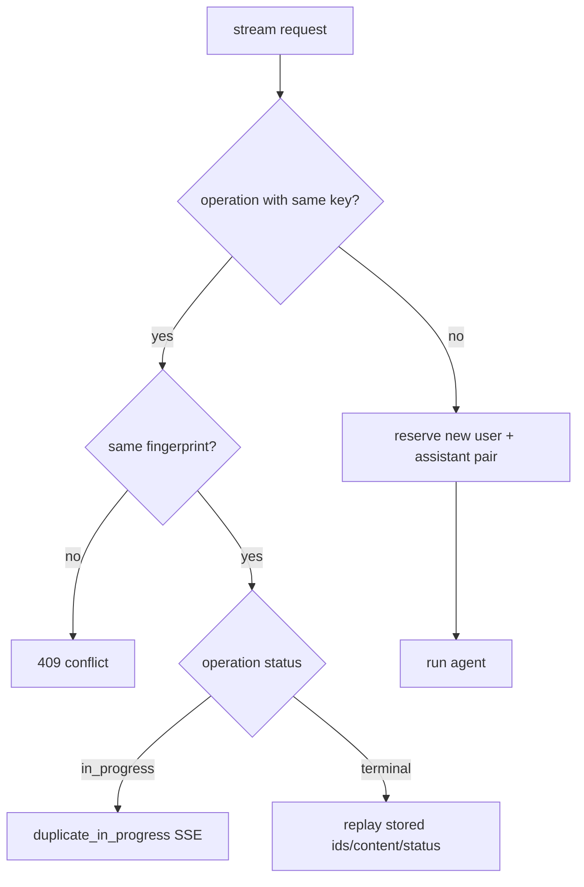

# Conversation History Architecture

This document gives a high-level map of the conversation history backend. For
implementation details, see the documents in `docs/conversation_history/implementation/`.

## What It Does

Conversation history makes the backend the owner of chat state. The client keeps
only lightweight identifiers, while the server persists chart profiles, sessions,
visible messages, stream operation metadata, and retry state.

The V1 model is intentionally linear:

- one anonymous owner has many chart profiles
- one chart profile has many sessions
- one session is one visible conversation thread
- messages are embedded inside the session document

Future branching can be modeled by copying a session up to a selected message
and continuing in a new session.

## System Shape



Main boundary:

- routes own HTTP, SSE, and agent orchestration
- store owns persistence consistency
- Beanie and MongoDB stay inside `api/chat/storage/`
- `api/chat/models.py` is the shared conversation-history DTO layer
- `api/schemas.py` is the HTTP wrapper layer

## Code Map

```text
api/chat/
  models.py          # DTOs and enums used by routes/store/tests
  contracts.py       # ConversationHistoryStore protocol and exceptions
  routes.py          # FastAPI routes, SSE, agent orchestration
  storage/
    documents.py     # Beanie documents
    mappers.py       # Beanie -> DTO conversion
    settings.py      # Mongo store settings
    store.py         # MongoConversationHistoryStore
```

Use this when reading the code:

- start in `routes.py` for HTTP status, headers, SSE shape, and agent behavior
- start in `store.py` for ownership, idempotency, reservation, finalization, and deletion
- start in `documents.py` for Mongo shape and indexes
- start in `models.py` for the stable conversation-history contract

## Data Model



MongoDB has two top-level collections:

- `chart_profiles`
- `sessions`

Messages and message operations are embedded in `sessions`. This keeps the
normal chat path simple: loading a session, reserving a message pair, and
finalizing an assistant message are all session-aggregate operations.

Owner access is checked through:

```text
Session -> ChartProfile -> owner_id
```

The session does not duplicate `owner_id`.

## Public API

Conversation history routes are mounted under `/api/v1`.

```text
POST   /anonymous

POST   /chart-profiles
GET    /chart-profiles
DELETE /chart-profiles/{chart_profile_id}

POST   /chart-profiles/{chart_profile_id}/sessions
GET    /chart-profiles/{chart_profile_id}/sessions

GET    /sessions/{session_id}
DELETE /sessions/{session_id}
POST   /sessions/{session_id}/chat/stream
```

Headers:

```http
X-Anonymous-Owner-Id: anon_...
Idempotency-Key: random-client-operation-id
```

`Idempotency-Key` is required for chart profile creation, session creation, and
session chat streaming. The anonymous endpoint does not require either header.

## Stream Lifecycle



The assistant response is not written token by token. The route accumulates the
visible assistant text in memory and writes it once when the stream reaches a
terminal state.

Terminal states:

- `confirmed`: agent completed successfully
- `failed`: model/server error, possibly with partial content
- `cancelled`: client disconnected, possibly with partial content

`cancelled` currently means the HTTP stream task was cancelled, usually because
the client disconnected, refreshed, aborted the request, or the server shut down
the in-flight stream. The backend should persist the cancelled status and
re-raise the cancellation rather than trying to send a final cancelled SSE event,
because the original client may no longer be connected.

## Future: Explicit Stop Generation

The frontend should eventually support a Stop Generating button. That should be
modeled as an application-level cancellation flow, not as `asyncio.CancelledError`
handling.

Expected shape:

- client starts a stream with `POST /sessions/{session_id}/chat/stream`
- backend stores enough operation identity to target the active generation
- client sends an explicit stop request for the active operation
- backend propagates cancellation to the active agent/model run so token
  generation actually stops, finalizes the assistant message as `cancelled`, and
  keeps any useful partial content
- if the stream is still connected, backend may send a terminal SSE event such
  as `done` with status `cancelled`
- if the stream is already gone, clients learn the final status by reloading the
  session

This keeps transport cancellation and intentional user cancellation distinct:
transport cancellation is a request lifecycle event, while Stop Generating is a
product action that can have its own API, UX, and persistence semantics.

## Retry And Idempotency

Idempotency protects durable writes, not the SSE transport itself.



For retries:

- same key and same payload reuses the original operation
- same key and different payload returns conflict
- terminal stream replay does not call the agent again
- duplicate in-progress replay does not attach to the original live stream

## Stale Pending Cleanup

A crash can leave an assistant message stuck as `pending`. Since V1 allows only
one pending assistant message per session, that would block future sends.

Cleanup runs before:

- loading session context
- reserving a new message pair

The store finds stale pending assistant ids, then performs one guarded update:

- matching stale assistant messages become `failed`
- matching in-progress message operations become `failed`
- messages that changed after the stale-id read are protected by status and
  timestamp guards

Threshold:

```text
CONVERSATION_HISTORY_STORE__STALE_PENDING_AFTER_SECONDS=900
```

## Core Invariants

- Beanie documents do not escape `api/chat/storage/`.
- Routes do not perform MongoDB queries directly.
- Store methods enforce owner access.
- Mutations that create resources or reserve messages require idempotency keys.
- Only one assistant message can be `pending` in a session.
- Only `confirmed` prior messages are sent back to the agent as history.
- Failed and cancelled messages can be rendered, but are not reliable context for
  future agent turns.
- Tool calls and tool results are stream/debug events only in V1; they are not
  durable transcript records.
- Soft-deleted chart profiles and sessions are hidden from normal reads.

## Design Tradeoffs

Embedded messages make V1 easy to reason about and keep most operations as
single-document updates. The cost is MongoDB document growth; summarization,
archival, or a separate message collection can be added later if real sessions
approach the document limit.

The system avoids Mongo multi-document transactions in V1. Resource-local
idempotency metadata, unique indexes, and conditional single-document updates
cover the current consistency needs. If idempotency moves to a separate ledger or
cross-document invariants become stronger, transaction boundaries should be
revisited.

Anonymous owner ids are bearer-style identifiers until real authentication
exists. Treat them as sensitive client-held tokens.
