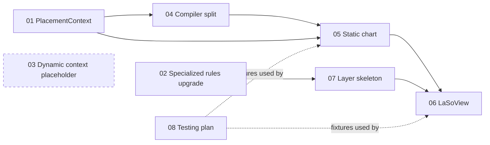

# Refactored architecture — plan index

This folder holds the plan for the next refactoring iteration of `src/refactored/`. The plan is split into one architecture overview and seven workstream files designed to be picked up and implemented in parallel by separate agents.

## Files

- [domain_context.md](domain_context.md) — domain primer (existing).
- [architecture.md](architecture.md) — goals, target architecture, all design decisions, module layout, vertical slice scope.
- [workstreams/01_placement_context.md](workstreams/01_placement_context.md) — `PlacementContext` Protocol + primitives refactor + `NatalContext`.
- [workstreams/02_specialized_rules_upgrade.md](workstreams/02_specialized_rules_upgrade.md) — self-validating `SpecializedPlacementRules` + `restrict_to(ids, seed)`.
- [workstreams/03_period_context.md](workstreams/03_period_context.md) — placeholder recording the constraints for future per-`LayerKind` dynamic context types. No code in this iteration.
- [workstreams/04_compiler_split_integrity.md](workstreams/04_compiler_split_integrity.md) — two `PlacementRuleCompiler` instances; catalog id guard lives in `LaSoBuilder` (WS05).
- [workstreams/05_static_chart.md](workstreams/05_static_chart.md) — `LaSo` immutable aggregate + `LaSoBuilder` + `Cung` population.
- [workstreams/06_laso_view.md](workstreams/06_laso_view.md) — `LaSoView` query facade + sao status resolver.
- [workstreams/07_layer_skeleton.md](workstreams/07_layer_skeleton.md) — `Layer`, `LayerKind`, `PeriodAnchor`, `CungAnchor`, projection sets, `LayerCompiler` Protocol (stubs).
- [workstreams/08_testing_plan.md](workstreams/08_testing_plan.md) — fixtures and acceptance tests.

## Dependency graph

WS03 is a deferred placeholder (no code in this iteration); it does not gate any other workstream.

## Suggested execution phases

- **Phase 1 (parallel)**: `01_placement_context`, `02_specialized_rules_upgrade`, `08_testing_plan`.
- **Phase 2**: `04_compiler_split_integrity` (after 01).
- **Phase 3 (parallel)**: `05_static_chart`, `07_layer_skeleton`.
- **Phase 4**: `06_laso_view`.

## Out of scope for this iteration

- Concrete `LayerCompiler` implementations for `TIEU_HAN`, `DAI_HAN`, `LUU_NIEN_DAI_HAN`, `TUHOA_PHAI` (the type shape is final; the bodies are stubbed).
- Migration of `src/tuvi/` consumers to `LaSoView`.
- Repackaging out of `src/refactored/` to a real package name.

## Conventions for agents working from this plan

- Do not change behavior outside your workstream's listed files unless explicitly noted.
- When in doubt about scope, prefer to declare a TODO in the workstream file rather than expanding scope silently.
- All public types introduced should be frozen (`@dataclass(frozen=True)` or `pydantic` `model_config = {"frozen": True}`).
- Every workstream lists its acceptance criteria; treat them as the definition of done.
