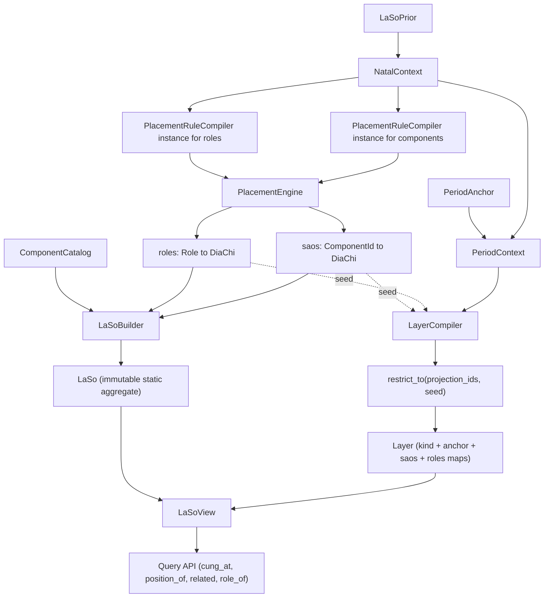

# Refactored architecture — overview

This document captures the architecture and the design decisions that the workstreams in [workstreams/](workstreams/) collectively implement. Read [domain_context.md](domain_context.md) first if you are new to the domain.

## Goals

- Make the static-vs-dynamic invariant explicit in the type system: a built `LaSo` is immutable; vận hạn information lives in separate `Layer` values overlaid via a `LaSoView`.
- Reuse the **single existing rule set** in [src/refactored/placement/rules.py](../placement/rules.py) for both static and dynamic computation. The architecture pivots on **context parameterization plus restriction-with-seed**, not on splitting the rule set.
- Within that single rule set, role rules and component rules are routed to **two instances of the existing `PlacementRuleCompiler`** so outputs naturally mirror `Cung.role: CungRole` vs `Cung.saos: tuple[Sao, ...]`.
- Land a static vertical slice that already fits the layered shape, so dynamic layers slot in later without reshaping core types.

## Pivotal clarifications

1. **One rule set.** `LIST_SAO_LUU` and `TU_HOA_IDS` are projection sets (subsets of component ids that overlay layers recompute), not separate rule lists.
2. **Hidden cross-cascades make naive recompile unsafe.** Many natal positions transitively depend on `thien_can` and `menh_position` (e.g. `liem_trinh` ← `tu_vi` ← `cuc` ← `menh_position + thien_can`). A "compile + project" pipeline that ran the full rule set under an override-bearing `PeriodContext` would silently corrupt those cascades. The overlay primitive is therefore **restriction with a natal seed** (Decision 9): only the projected rules execute under `PeriodContext`; every external reference is wired to the canonical natal positions map.
3. **Two ontologies, two compiler instances.** The single rule set is partitioned by ontology at registration time; each partition is fed to its own instance of the existing `PlacementRuleCompiler`.

## Target architecture



## Five concerns, each with a sharp boundary

1. **Context layer** — `NatalContext` (today's `LaSoContext` refined) and `PeriodContext` (a `NatalContext`-derived value with selected fields overridden). Both implement a single `PlacementContext` Protocol that all rule primitives consume.
2. **Rule layer** — one rule set in [rules.py](../placement/rules.py), one engine, two instances of the existing `PlacementRuleCompiler` differing only in which rules they receive: a *role compiler* fed with `ROLE_RULES`, a *component compiler* fed with `CHINH_TINH_RULES + PHU_TINH_RULES + TU_HOA_RULES`.
3. **Static aggregate** — `LaSoBuilder` consumes positions maps and the `ComponentCatalog`, returns an immutable `LaSo` with 12 populated `Cung`.
4. **Dynamic layer** — `Layer` value object + one `LayerCompiler` per `LayerKind`. Each `Layer` is single-anchor with flat `saos` (`dict[ComponentId, DiaChi]`) and `roles` (`dict[Role, DiaChi]`, the rotated cung-role frame for that slice; empty for kinds like TuHoaPhái that do not rotate roles). Multi-anchor patterns (TuHoaPhái) produce multiple `Layer`s atomically in one compile call. Cross-layer dependencies (e.g. lưu niên đại hạn → đại hạn) are expressed by the dependent compiler taking the prerequisite `Layer` as a typed input parameter. Static `LaSo` is never mutated.
5. **Query facade** — `LaSoView` composes one `LaSo` with dynamic layers stored as **`Mapping[LayerRef, Layer]`**, exposing the domain questions with explicit provenance (`LayerRef | None` for natal).

## Key design decisions

- **Decision 1 — `PlacementContext` marker Protocol.** Define a structural marker Protocol with no required members so primitives have a meaningful parameter type. Each context class advertises the surface it actually has (e.g. `dia_chi`, `thien_can`, `menh_position`, `cuc`, `van_direction()`, `prior`); primitives access whatever they need ad hoc. Property names drop the `year_` prefix so they remain accurate when a future context (e.g. TuHoaPhái) supplies a non-year `thien_can`. See [workstreams/01_placement_context.md](workstreams/01_placement_context.md).
- **Decision 2 — Dynamic contexts are per-`LayerKind`, self-contained, built by their LayerCompiler.** No shared `PeriodContext` base, no fallback-to-natal delegation. Each future `LayerCompiler` defines its own frozen context value class exposing only the fields its primitives consume; all such classes structurally satisfy the marker `PlacementContext` from Decision 1. See [workstreams/03_period_context.md](workstreams/03_period_context.md) for the recorded constraints.
- **Decision 3 — `Layer` is single-anchor and flat; multi-anchor patterns produce multiple layers; cross-layer dependencies are explicit in compiler signatures.** A `Layer` contains `kind: LayerKind`, `anchor: LayerAnchor` (a tagged union: `PeriodAnchor` for vận hạn, `CungAnchor` for TuHoaPhái), `saos: dict[ComponentId, DiaChi]`, and `roles: dict[Role, DiaChi]` (where each `Role` maps to the `DiaChi` of that role label in this layer’s frame; empty when the kind does not rotate roles, e.g. TuHoaPhái). **Naming note:** this is not the same shape as `Cung.saos` (a `tuple` of catalog Sao entities on a palace); on `Layer`, `saos` is a position map keyed by id. **`LayerRef`** is the frozen `(kind, anchor)` identity; **`Layer.ref()`** returns it so `Layer` need not embed a stored ref (payload can evolve). Compiler↔kind shape: TIEU_HAN, DAI_HAN, LUU_NIEN_DAI_HAN compilers each produce 1 layer; TUHOA_PHAI produces 12 (one per natal Cung) atomically in one compile pass. The lưu niên đại hạn compiler accepts the built đại hạn `Layer` as an input parameter, making the cross-layer data dependency explicit in its type signature instead of being baked into class identity. Same component id (e.g. `hoa_loc`) can appear in multiple layers; consumers see them as distinct entries by their anchor. See [workstreams/07_layer_skeleton.md](workstreams/07_layer_skeleton.md).
- **Decision 4 — `LaSo` is fully immutable.** `Cung.saos: tuple[Sao, ...]` (not `list`), no setters. Re-resolution = build a new `LaSo`. See [workstreams/05_static_chart.md](workstreams/05_static_chart.md).
- **Decision 5 — Sao status resolved at view time.** `MAP_SAO_STATUS` becomes a `SaoStatusResolver` injected into `LaSoView`. The same `LaSo` can be rendered with different status tables (production swap-ability, testability). See [workstreams/06_laso_view.md](workstreams/06_laso_view.md).
- **Decision 6 — Two compiler instances, no new classes.** The single rule set is partitioned by ontology at registration time and fed into two instances of the existing `PlacementRuleCompiler`. No subclasses, no wrappers. Catalog id coverage is enforced at chart build (Decision 7), not as duplicate validators in workstream 04. See [workstreams/04_compiler_split_integrity.md](workstreams/04_compiler_split_integrity.md).
- **Decision 7 — Catalog vs rules, one check at `LaSo` build.** When building a `LaSo`, assert **one** invariant: every placement id registered on **both** compilers (roles + components) resolves in [component_catalog.py](../builder/component_catalog.py)’s JSON-backed id map (which already includes `CungRole` alongside sao / tu hoa / etc.). Call site: `LaSoBuilder.build` (workstream 05), not a separate pre-flight in workstream 04. **Not required:** every catalog JSON row must have a placement rule (unused rows are allowed). See [workstreams/05_static_chart.md](workstreams/05_static_chart.md).
- **Decision 8 — No rule-set split.** Rules stay in one file, one logical set. The split is at the *compiler/registry instance* level only.
- **Decision 9 — Restriction with natal seed (not plain projection).** The compiled artifact exposes `SpecializedPlacementRules.restrict_to(ids, seed) -> SpecializedPlacementRules` which keeps only specs for `ids` and replaces every external reference with a constant `SpecializedAbsoluteSpec` reading from `seed`. Engine code is unchanged. **Two-layer validation, separated by ownership:**
  1. *Structural invariant* (artifact-owned): `SpecializedPlacementRules` self-validates in `__post_init__` that every relative spec's `reference_id` is a key in its own spec map. Today's `PlacementRuleCompiler._validate_references_exist` moves here.
  2. *Seed-coverage contract* (operation-owned): inside `restrict_to`, before rewriting externals, check that every external reference of kept rules is present in `seed`. Fails with a precise error rather than a generic structural failure.

  See [workstreams/02_specialized_rules_upgrade.md](workstreams/02_specialized_rules_upgrade.md).
- **Decision 10 — Tu Hoa overlays (incl. Tu Hoa Phái) work without rule or primitive changes.** Each Tu Hoa overlay = `restrict_to({hoa_loc, hoa_quyen, hoa_khoa, hoa_ky}, seed=natal_positions)` under a context whose `thien_can` differs from natal:
  - For `TIEU_HAN` / `DAI_HAN` / `LUU_NIEN_DAI_HAN`: a Tu Hoa overlay is part of that period's single Layer (alongside lưu sao `components` and rotated `roles`), so one `restrict_to` run feeds into the same Layer.
  - For `TUHOA_PHAI`: 12 separate Layers, one per natal Cung, each anchored on `CungAnchor` and produced by one `restrict_to` run that supplies that Cung's `cung_thien_can_for(natal.thien_can, dia_chi)` value as the context's `thien_can`. All 12 are produced atomically in one compile call.
- **Decision 11 — Projection contract.** Each `LayerKind`'s projection set must be self-contained or every external reference must be in the natal seed. The natal seed produced by the static run is canonical; layers consume it as data, not as rules.
- **Decision 12 — Domain naming alignment.** `Component` and `Sao` are **`TypeAlias`** names, not superclasses. **`Sao = ChinhPhuTinh | TuHoa | VongTrangSinh | TuanTriet`**. **`Component = DiaChiEntity | ThienCanEntity | Cuc | CungRole | Sao`** (strict union for catalog/chart typing). Concrete models still subclass **`ComponentBase`**. `ComponentId` and `component_id` in placement APIs stay unchanged. See [workstreams/09_domain_naming_alignment.md](workstreams/09_domain_naming_alignment.md).

## New module layout

```
src/refactored/
  component/...                       (unchanged — entities, prior already there)
  placement/
    primitives.py                     (refactor: read via PlacementContext protocol)
    rules.py                          (unchanged file, but expose role rules and component rules as separate lists)
    registry.py                       (unchanged)
    compiler.py                       (no new classes; lift structural validation onto SpecializedPlacementRules; add restrict_to(ids, seed); optional minimal accessor for registered rule ids for LaSoBuilder)
    engine.py                         (unchanged)
  context/                            (NEW)
    protocol.py                       (PlacementContext Protocol)
    natal.py                          (NatalContext implements PlacementContext; replaces LaSoContext)
    period.py                         (PeriodAnchor, PeriodContext placeholder)
  chart/                              (NEW)
    laso.py                           (LaSo, Cung population, immutable)
    builder.py                        (LaSoBuilder)
    view.py                           (LaSoView, query API, status resolver)
  layer/                              (NEW)
    types.py                          (LayerKind incl. TUHOA_PHAI; LayerRef; LayerAnchor; Layer; LIST_SAO_LUU + TU_HOA_IDS projections)
    compiler.py                       (LayerCompiler protocol; stubs per kind)
  builder/component_catalog.py        (unchanged)
```

## Vertical slice for this iteration

Static end-to-end + dynamic types declared (compilers stubbed):

- Naming baseline first: apply [workstreams/09_domain_naming_alignment.md](workstreams/09_domain_naming_alignment.md) before behavior work so all subsequent implementation uses stable vocabulary (`Component` / `Sao` as type aliases, `CungRole`, `saos`, `sao_positions`).
- `PlacementContext` Protocol; primitives refactored to consume it.
- `NatalContext` (replaces `LaSoContext`, back-compat alias kept during migration).
- Two instances of the existing `PlacementRuleCompiler` on the same engine; `LaSoBuilder.build` runs the single catalog guard over registered ids from both compilers.
- `SpecializedPlacementRules` self-validates structurally; `restrict_to(ids, seed)` implemented and unit-tested (incl. seed-coverage contract check).
- `LaSo`, `Cung` populated, `LaSoBuilder` working — `Cung.role` from role compiler output, `Cung.saos` from component compiler output.
- `LaSoView` with static query API: `cung_at`, `role_of`, `related(dia_chi)`, plus layer-aware queries per [workstreams/06_laso_view.md](workstreams/06_laso_view.md) (`PlacedComponent`, `positions_of`, `dict[LayerRef, Layer]` / `build`, etc.).
- `Layer`, `LayerRef`, `LayerKind` (incl. `TUHOA_PHAI`), `PeriodAnchor`, `CungAnchor`, `LayerAnchor`, `LayerCompiler` protocol declared; `Layer.ref()` returns `LayerRef`. `LIST_SAO_LUU` and `TU_HOA_IDS` live in `layer/types.py` as projection sets.
- `LaSoView` holds `layers` as `Mapping[LayerRef, Layer]` (built via `LaSoView.build` from a mapping or iterable of `Layer`) so the API is in its final shape.

## Open follow-ups (call out, don't do now)

- Concrete `LayerCompiler` implementations for `TIEU_HAN` / `DAI_HAN` / `LUU_NIEN_DAI_HAN` / `TUHOA_PHAI` (they will reuse `restrict_to` plus self-contained per-kind dynamic contexts; see [workstreams/03_period_context.md](workstreams/03_period_context.md)).
- When implementing them, confirm the exact override set per `LayerKind` against the lưu rule references in [rules.py](../placement/rules.py) (Vong Thái Tuế, Lộc Tồn group, Thiên Mã, Thiên Khốc/Thiên Hư).
- Decide whether `LaSoView` lazily compiles requested periods or accepts pre-built `Layer`s only (recommend the latter; simpler).
- Move `src/refactored/` to a real package name; keep an import shim during transition.
- Migrate `src/tuvi/` consumers (e.g. [src/tuvi/tinh_ban.py](../../tuvi/tinh_ban.py)) to the new `LaSoView`.
